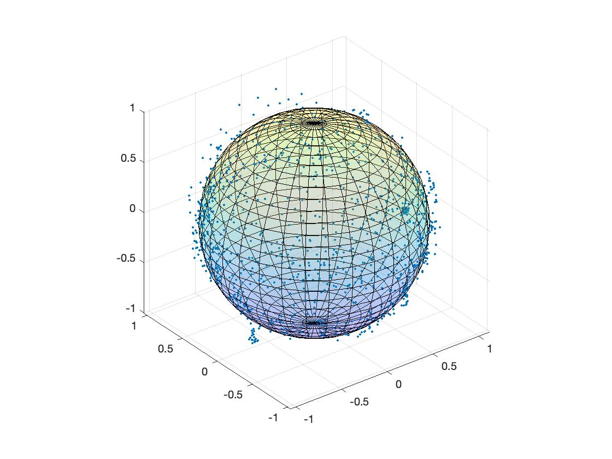
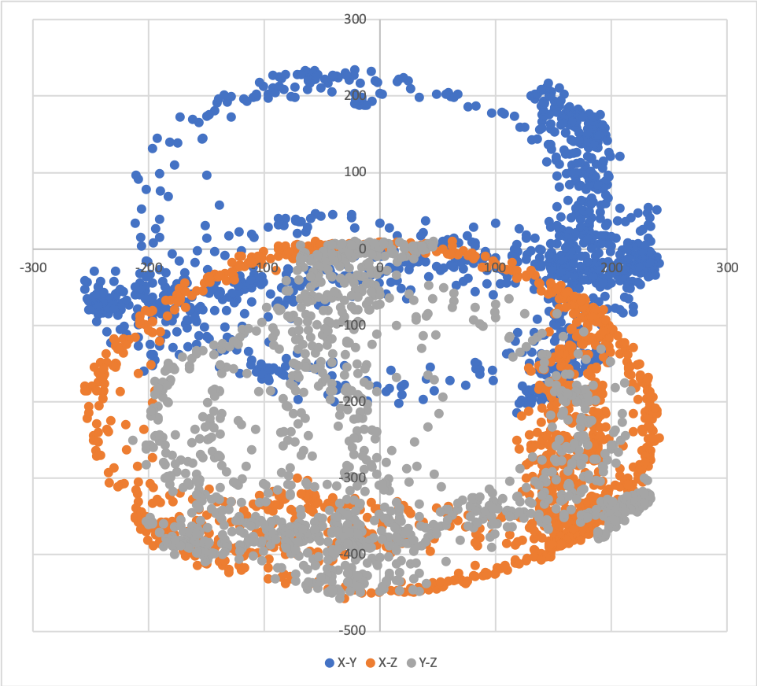
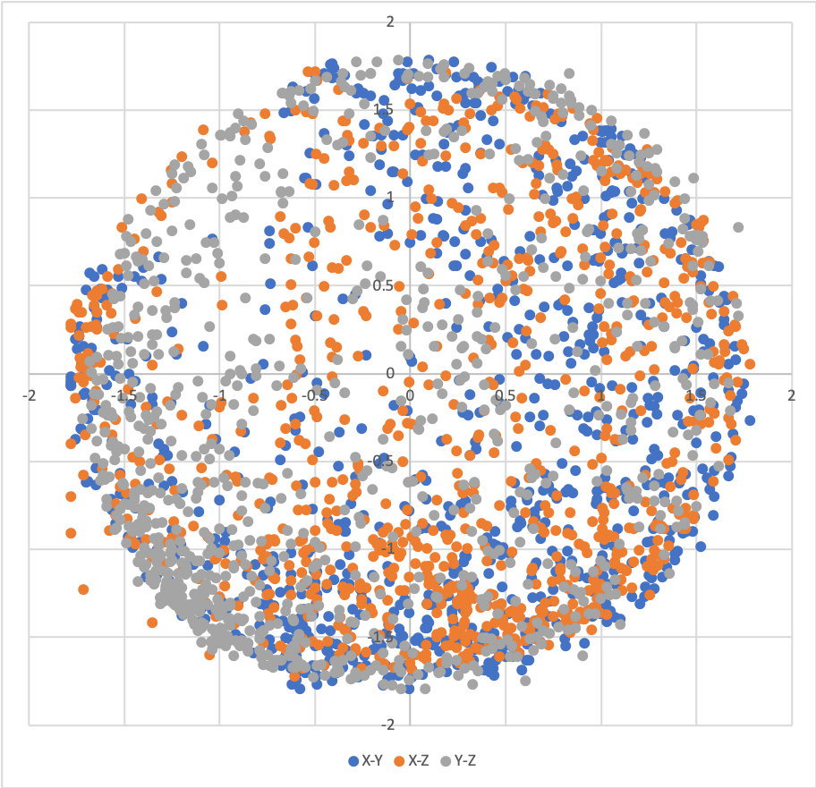
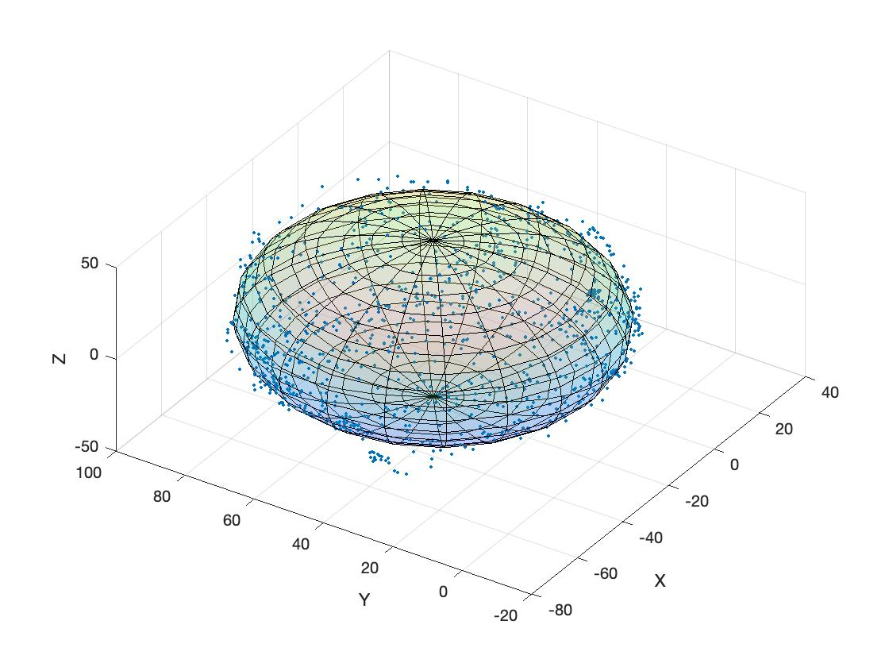

How to calibrate a magnetometer & accelerometer (MPU9250)
##############################################################

.. post:: 13, Oct 2019
    :tags: Microcontroller, MPU9250
    :category: Microcontroller
    :author: Earsuit

The magnetometer is a device that measures the direction and strength of magnetism. As we all know, compass is a famous 
type of magnetometer which tells the orientation by measuring the Earth's magnetic field. Here I will present three 
methods to calibrate the magnetometer, one is simple and straight forward and the other two utilize Least-Squares 
estimation, which can be done offline or online.

The code can be downloaded from `here <https://github.com/Earsuit/MPU9250-calibration>`_.

The same can be done for calibrating the accelerometer, once you rotate the sensor slowly.

Ideal world
============

In ideal case, the measured magnetic field :math:`B_m^s` in sensor frame is given by

.. math::

	\begin{equation} \boldsymbol B_m^s =\boldsymbol R_x(\alpha)\boldsymbol R_y(\beta)\boldsymbol R_z(\gamma)\boldsymbol B_e^g \end{equation}

where :math:`\boldsymbol B_e^g = B\begin{bmatrix}cos(\delta)\\0\\sin(\delta)\end{bmatrix}` is the Earth's magnetic field 
vector which has magnitude B and magnetic inclination :math:`\delta` in ground frame and 
:math:`\boldsymbol R_x(\alpha),\boldsymbol R_y(\beta),\boldsymbol R_z(\gamma)` are the rotation matrices rotate around x,
y,z axes. The bold version means it's a vector or matrix.

Simply modifying the above equation gives the locus of the magnetometer measurements under arbitrary rotation of the chips

.. math::

	\begin{equation} (\boldsymbol B_m^s)^T\boldsymbol B_m^s = (\boldsymbol R_x(\alpha)\boldsymbol R_y(\beta)\boldsymbol R_z(\gamma)\boldsymbol B_e^g)^T \boldsymbol R_x(\alpha)\boldsymbol R_y(\beta)\boldsymbol R_z(\gamma)\boldsymbol B_e^g \end{equation}

.. math::

	\begin{equation} (\boldsymbol B_m^s)^T\boldsymbol B_m^s = (\boldsymbol RB\begin{bmatrix}cos(\delta)\\0\\sin(\delta)\end{bmatrix})^T \boldsymbol RB\begin{bmatrix}cos(\delta)\\0\\sin(\delta)\end{bmatrix} \end{equation}

.. math::
	:name: eq:locus_ideal

	\begin{equation} (\boldsymbol B_m^s)^T\boldsymbol B_m^s = B^2 \end{equation} \label{eq:locus_ideal}

As :math:`\boldsymbol R` is a rotation matrix, the transpose of it is identical to rotation by the inverse angle, given :math:`(\boldsymbol R)^T \boldsymbol R = \boldsymbol I`. Where we define :math:`\boldsymbol R = \boldsymbol R_x(\alpha)\boldsymbol R_y(\beta)\boldsymbol R_z(\gamma)`.

:ref:`Equation <eq:locus_ideal>` defines the locus of the magnetometer measurements lying on the surface of a sphere centered at origin with radius equal to :math:`B`.

	Locus of the magnetometer measurements in ideal case

Real world
===========

However, besides the Earth's magnetic field, many objects around the magnetometer can interfere the measured magnetism, 
and they can be classified as hard-iron interference and soft-iron interference.

The hard-iron interference is usually caused by the permanently magnetized ferromagnetic objects which add or subtract 
to the Earth's magnetic field. In most cases, we can assume it's a constant :math:`\boldsymbol v`. Unlike the hard-iron 
interference, the soft-iron interference is the change in magnitude and direction of the Earth's magnetic field, which 
can be modelled as a matrix :math:`\boldsymbol W`.

Considering the effect of these interference, the equation 1 becomes to

.. math::
	
	\begin{equation} \boldsymbol B_m^s =\boldsymbol W\boldsymbol R_x(\alpha)\boldsymbol R_y(\beta)\boldsymbol R_z(\gamma)\boldsymbol B_e^g + \boldsymbol V \end{equation}

This time, the locus of the magnetometer measurements lies on a surface of an ellipsoid shifted away from the origin by 
:math:`\boldsymbol V`:

.. math::

	\begin{equation} (\boldsymbol B_m^s - \boldsymbol V)^T (\boldsymbol W^{-1})^T \boldsymbol W^{-1}(\boldsymbol B_m^s - \boldsymbol V) = B^2 \end{equation}

Affine transformation
======================

The calibration process tries to estimate the ellipsoid and transform it back to a sphere. To do this, we need to build 
an affine transformation between a sphere and an ellipsoid.

This transformation that map a unit sphere to an ellipsoid can be performed by stretching along axis then rotating 
around each axis:

.. math::

	\begin{equation} \begin{bmatrix}x'\\y'\\z'\end{bmatrix} = \boldsymbol{R}_1(\alpha)\boldsymbol{R}_2(\beta)\boldsymbol{R}_3(\gamma)\boldsymbol{J}(a,b,c)\begin{bmatrix}x\\y\\z\end{bmatrix} + \begin{bmatrix}x_0\\y_0\\z_0\end{bmatrix}\end{equation}

where :math:`\boldsymbol{J}(a,b,c) = \begin{bmatrix}a & 0 &0\\0 & b &0\\0&0&c\end{bmatrix}`

The inverse transformation is given by

.. math::

	\begin{equation} \begin{bmatrix}x\\y\\z\end{bmatrix} = \boldsymbol{M}\begin{bmatrix}x'\\y'\\z'\end{bmatrix} - \boldsymbol{M} \begin{bmatrix}x_0\\y_0\\z_0\end{bmatrix} \end{equation}

with :math:`\boldsymbol{M} = J(\frac{1}{a},\frac{1}{b},\frac{1}{c})\boldsymbol{R}_3(-\gamma)\boldsymbol{R}_2(-\beta)\boldsymbol{R}_1(-\alpha)`.

In our case the ellipsoid is aligned with axis, thus no rotation is performed (:math:`\alpha = \beta = \gamma = 0`).

Method 1: Simple way to Calibrate
===================================

After knowing the effect of the interference, the following part introduces a simple and effective calibration 
algorithm. By rotating the magnetometer at one point, the maximum and minimum reading of each axis can be recored, which 
leads to the value of :math:`\boldsymbol V`:

.. math::

	\begin{equation} V_x = \frac{x_{max}+x_{min}}{2} \end{equation}

.. math::

	\begin{equation} V_y = \frac{y_{max}+y_{min}}{2} \end{equation}

.. math::

	\begin{equation} V_z = \frac{z_{max}+z_{min}}{2} \end{equation}

For the soft-iron interference, we need map an ellipsoid to a sphere. We know that an ellipsoid is given in the form of

.. math::
	:name: eq:ellipsoid

	\begin{equation} (\boldsymbol x - \boldsymbol x)^T \boldsymbol A (\boldsymbol x - \boldsymbol v) = 1 \end{equation} \label{eq:ellipsoid}

given that A must be diagonalized by :math:`\boldsymbol A = \boldsymbol R^T \boldsymbol D \boldsymbol R`, where 
:math:`\boldsymbol R`is an orthonormal matrix and :math:`\boldsymbol D` is a diagonal matrix.

A sphere can be obtained by simply modify :ref:`this equation <eq:ellipsoid>`:

.. math::

	\begin{equation} (\boldsymbol x - \boldsymbol v)^T \boldsymbol A (\boldsymbol x - \boldsymbol v) = [\boldsymbol D^{\frac{1}{2}}\boldsymbol R (\boldsymbol x - \boldsymbol v)]^T[\boldsymbol D^{\frac{1}{2}}\boldsymbol R (\boldsymbol x - \boldsymbol v)] = 1 \end{equation}

In our case, the principle axes of the ellipsoid coincide with the X,Y and Z axis, thus the matrix 
:math:`\boldsymbol A` is diagonal and the diagonal entries are the inverse of the length of each principle axis 
(:math:`\boldsymbol D = \boldsymbol A, \boldsymbol R = \boldsymbol I`).

The length of elliptical principle axes is given by:

.. math::

	\begin{equation} L_x = \frac{x_{max}-x_{min}}{2} \end{equation}

.. math::

	\begin{equation} L_y = \frac{y_{max}-y_{min}}{2} \end{equation}

.. math::

	\begin{equation} L_z = \frac{z_{max}-z_{min}}{2} \end{equation}

Now we get the matrix :math:`\boldsymbol A = \begin{bmatrix}L_x & 0 &0\\0 & L_y & 0\\0 & 0 & L_z\end{bmatrix}`, do we 
need to compute the square root of it? The answer is no, as we don't care about the real strength of magnetism. Thus a 
scaled sphere is given by

.. math::

	\begin{equation} [\boldsymbol A(\boldsymbol x - \boldsymbol v)]^T[\boldsymbol A(\boldsymbol x - \boldsymbol v)] = 1 \end{equation}

Try it on real data
----------------------

The magnetometer.ino is the code needed to be uploaded to the Arduino, and the magnetometer.py is a python 3 program for 
receiving the readings and write to a .csv file, which can be opened by Excel.

Please enter your port name for the Arduino in the magnetometer.py.

Before calibration, the readings of three axes in 2D looks like this

	
	Scatter plot of raw readings

Once the calibration process started, turning the sensor through a variety of figure-eight patterns, the final scatter 
plot should looks like

	Scatter plot of calibrated readings

We can see that this simple method works.

In the .csv file, we can find that the estimated hard-iron interference and soft-iron interference converge to some values after server seconds.

Methood 2: Offline Least-Squares fitting of an ellipsoid
==========================================================

However, the method 1 sometimes is not good enough to capture the property of an ellipsoid. Therefore, least square 
estimation comes into play. Again, the general equation for a non-rotated ellipsoid is given by

.. math::

	\begin{equation} (\boldsymbol x - \boldsymbol v)^T \boldsymbol A (\boldsymbol x - \boldsymbol v) = 1 \end{equation}

where

.. math::

	\begin{equation*} \boldsymbol{A} = \begin{bmatrix}\frac{1}{{x_r}^2} & 0 & 0\\0 & \frac{1}{{y_r}^2} & 0\\0 & 0 & \frac{1}{{z_r}^2}\end{bmatrix} \\ \boldsymbol{v} = \begin{bmatrix}x_c\\y_c\\z_c\end{bmatrix} \end{equation*}

and :math:`x_r,y_r,z_r` are half the length of the principal axes, :math:`x_c,y_c,z_c` represent the center of it.

Writing the above equation in quadratic form gives

.. math::

	\begin{equation} x^2 + \frac{{x_r}^2}{{y_r}^2}y^2 + \frac{{x_r}^2}{{z_r}^2}z^2 - 2x_cx - 2\frac{{x_r}^2}{{y_r}^2}y_cy - 2\frac{{x_r}^2}{{z_r}^2}z_cz + {x_c}^2 + \frac{{x_r}^2}{{y_r}^2}{y_c}^2 + \frac{{x_r}^2}{{z_r}^2}{z_c}^2 - {x_r}^2 = 0 \end{equation}

To simplify the process, let us define:

.. math::

	\begin{equation*} \begin{aligned}a & = \frac{{x_r}^2}{{y_r}^2}\\ b & = \frac{{x_r}^2}{{z_r}^2}\\ c & = -2x_c \\ d & = -2\frac{{x_r}^2}{{y_r}^2}y_c \\ e & = -2\frac{{x_r}^2}{{z_r}^2}z_c\\ f& = {x_c}^2 + \frac{{x_r}^2}{{y_r}^2}{y_c}^2 + \frac{{x_r}^2}{{z_r}^2}{z_c}^2 - {x_r}^2 \end{aligned} \end{equation*}

which gives

.. math::
	:name: eq:quadratic

	\begin{equation} ay^2 + bz^2 + cx + dy + ez + f = -x^2 \end{equation} \label{eq:quadratic}

Let's assume we have a set of data which contains n measuremens, then we have

.. math::

	\begin{equation} \begin{aligned}\begin{bmatrix}-{x_0}^2\\-{x_1}^2\\...\\-{x_n}^2\end{bmatrix} & = \begin{bmatrix}{y_0}^2 & {z_0}^2 & x_0 & y_0 & z_0 & 1\\{y_1}^2 & {z_1}^2 & x_1 & y_1 & z_1 & 1\\... & ... & ... & ...& ... & ... \\{y_n}^2 & {z_n}^2 & x_n & y_n & z_n & 1\end{bmatrix} \begin{bmatrix}a\\b\\c\\d\\e\\f\end{bmatrix} \\ \boldsymbol{Y} & = \boldsymbol{\Psi}\boldsymbol{\Theta}
	\end{aligned} \end{equation}

The error squared we want to minimize is

.. math::

	\begin{equation} \epsilon = \boldsymbol{E}^T \boldsymbol{E} = (\boldsymbol{Y} - \boldsymbol{\Psi}\boldsymbol{\Theta})^T(\boldsymbol{Y} - \boldsymbol{\Psi}\boldsymbol{\Theta}) \end{equation}

To find the :math:`\boldsymbol{\Theta}` that minimiszes the error, we need to differentiate :math:`\epsilon` w.r.t 
:math:`\boldsymbol{\Theta}` and set it to zero.

.. math::

	\begin{equation} \frac{d\epsilon}{d\boldsymbol{\Theta}} = 2\boldsymbol{\Psi}^T\boldsymbol{\Psi}\boldsymbol{\Theta} - 2\boldsymbol{\Psi}^T\boldsymbol{Y} = 0 \\\boldsymbol{\Psi}^T\boldsymbol{\Psi}\boldsymbol{\Theta} = \boldsymbol{\Psi}^T\boldsymbol{Y} \end{equation}

Now provided that :math:`\boldsymbol{\Psi}^T\boldsymbol{\Psi}` is invertible we can solve for the least-squares 
parameter estimate as

.. math::

	\begin{equation}\boldsymbol{\Theta} = (\boldsymbol{\Psi}^T\boldsymbol{\Psi})^{-1}\boldsymbol{\Psi}^T\boldsymbol{Y} \end{equation}
	\label{eq:LS}

Once we get :math:`x_c,y_c,z_c,x_r,y_r,z_r`, we can use the affine transformation obtained to map it to a unit sphere.

Try it on real data
---------------------

As this method is an offline method, we need to capture as much data as we can and do it with Matlab or some other tools.

The result for the ellipsoid and mapped unit sphere are shown below.

	Plot of the estimated sllipsoid

.. figure:: ../assets/how_to_calibriate_a_magnetometer_and_accelerometer/mapped_unit_sphere.jpg

	Mapped unit sphere

Method 3: Recursive Least-Squares for online identification
============================================================

Someone one might worry that what if the interference changed once we have finished the offline calibration? Do we need 
to calibrate again? Fortunately, most of the time the change of the interference is not significant. This online method 
is just for people that want to ensure the estimation of the ellipsoid remain a certain accuracy with respect to the 
change of the environment. The draw back of the online method is that it's computationally expensive.

The purpose is to update the estimatation as each new data point becomes available.

With :ref:`equation <eq:quadratic>`, we define :math:`\boldsymbol{r} = \begin{bmatrix} y^2 & z^2 & x & y & z & 1\end{bmatrix}`.

Assume we already have N sets of data:

.. math::

	\begin{equation}\boldsymbol{\Theta}_N = (\boldsymbol{\Psi}_N^T\boldsymbol{\Psi}_N)^{-1}\boldsymbol{\Psi}^T_N\boldsymbol{Y} _N\end{equation}

Let's see how it will change when we add an extra data point:

.. math::
	:name: eq:extra_data

	\begin{equation}\boldsymbol{\Theta}_{N+1} = (\boldsymbol{\Psi}_{N+1}^T\boldsymbol{\Psi}_{N+1})^{-1}\boldsymbol{\Psi}^T_{N+1}\boldsymbol{Y} _{N+1} \label{eq:extra_data}\end{equation}

Firstly, take a look at the first part :math:`(\boldsymbol{\Psi}_{N+1}^T\boldsymbol{\Psi}_{N+1})^{-1}`. We know that

.. math::
	:name: eq:first_part

	\begin{equation}\boldsymbol{\Psi}_{N+1}^T\boldsymbol{\Psi}_{N+1} = \sum_{k=0}^{N+1}\boldsymbol{r}_k^T\boldsymbol{r}_k = \sum_{k=0}^{N} \boldsymbol{r}_k^T\boldsymbol{r}_k + \boldsymbol{r}_{N+1}^T\boldsymbol{r}_{N+1} = \boldsymbol{\Psi}_N^T\boldsymbol{\Psi}_N + \boldsymbol{r}_{N+1}^T\boldsymbol{r}_{N+1} \label{eq:first_part}\end{equation}

Then, let's define :math:`\boldsymbol{P}_{N+1} = (\boldsymbol{\Psi}_{N+1}^T\boldsymbol{\Psi}_{N+1})^{-1}`, the  
:ref:`equation <eq:first_part>` can be written as

.. math::

	\begin{equation} \boldsymbol{P}_{N+1} = (\boldsymbol{P}_N^{-1}+\boldsymbol{r}_{N+1}^T\boldsymbol{r}_{N+1})^{-1} \end{equation}

According to the matrix inversion lemma:

.. math::

	\begin{equation} (\boldsymbol{A}+\boldsymbol{B}\boldsymbol{C}\boldsymbol{D})^{-1} = \boldsymbol{A}^{-1} - \boldsymbol{A}^{-1}\boldsymbol{B}(\boldsymbol{C}^{-1}+\boldsymbol{D}\boldsymbol{A}^{-1}\boldsymbol{B})^{-1}\boldsymbol{D}\boldsymbol{A}^{-1} \end{equation}

then we have

.. math::
	:name: eq:term1

	\begin{equation} \boldsymbol{P}_{N+1} = \boldsymbol{P}_N - \boldsymbol{P}_N\boldsymbol{r}^T_{N+1}(1+\boldsymbol{r}_{N+1}\boldsymbol{P}_N\boldsymbol{r}_{N+1}^T)^{-1}\boldsymbol{r}_{N+1}\boldsymbol{P}_N = \boldsymbol{P}_N - \frac{\boldsymbol{P}_N\boldsymbol{r}^T_{N+1}\boldsymbol{r}_{N+1}\boldsymbol{P}_N}{1+\boldsymbol{r}_{N+1}\boldsymbol{P}_N\boldsymbol{r}_{N+1}^T} \label{eq:term1} \end{equation}

We can see that this gives us a recursive way to update the first part without any matrix inversion! Secondly, let's consider :math:`\boldsymbol{\Psi}^T_{N+1}\boldsymbol{Y}_{N+1}`.

.. math::
	:name: eq:term2

	\begin{equation}\boldsymbol{\Psi}^T_{N+1}\boldsymbol{Y}_{N+1} = \boldsymbol{\Psi}^T_N\boldsymbol{Y}_N + \boldsymbol{r}^T_{N+1}y_{N+1} \label{eq:term2}\end{equation}

Now substitute :ref:`equation <eq:term1>` and :ref:`equation <eq:term2>` into equation :ref:`equation <eq:extra_data>`

.. math::

	\begin{aligned}
	\boldsymbol{\Theta}_{N+1} & = (\boldsymbol{\Psi}_{N+1}^T\boldsymbol{\Psi}_{N+1})^{-1}\boldsymbol{\Psi}^T_{N+1}\boldsymbol{Y}_{N+1}\\
	& = (\boldsymbol{P}_N - \frac{\boldsymbol{P}_N\boldsymbol{r}^T_{N+1}\boldsymbol{r}_{N+1}\boldsymbol{P}_N}{1+\boldsymbol{r}_{N+1}\boldsymbol{P}_N\boldsymbol{r}_{N+1}^T})(\boldsymbol{\Psi}^T_N\boldsymbol{Y}_N + \boldsymbol{r}^T_{N+1}y_{N+1}) \\
	& = \boldsymbol{P}_N \boldsymbol{\Psi}^T_N \boldsymbol{Y}_N + \boldsymbol{P}_N \boldsymbol{r}^T_{N+1}y_{N+1} - \frac{\boldsymbol{P}_N \boldsymbol{r}^T_{N+1} \boldsymbol{r}_{N+1} \boldsymbol{P}_N(\boldsymbol{\Psi}^T_N \boldsymbol{Y}_N + \boldsymbol{r}^T_{N+1}y_{N+1})}{1+\boldsymbol{r}_{N+1} \boldsymbol{P}_N \boldsymbol{r}^T_{N+1}} \\
	& = \boldsymbol{\Theta}_N + \frac{\boldsymbol{P}_N \boldsymbol{r}^T_{N+1}y_{N+1}(1+\boldsymbol{r}_{N+1} \boldsymbol{P}_N \boldsymbol{r}^T_{N+1}) - \boldsymbol{P}_N \boldsymbol{r}^T_{N+1} \boldsymbol{r}_{N+1} \boldsymbol{P}_N(\boldsymbol{\Psi}^T_N \boldsymbol{Y}_N + \boldsymbol{r}^T_{N+1}y_{N+1})}{1+\boldsymbol{r}_{N+1} \boldsymbol{P}_N \boldsymbol{r}^T_{N+1}}\\
	& = \boldsymbol{\Theta}_N + \frac{\boldsymbol{P}_N \boldsymbol{r}^T_{N+1}}{1+\boldsymbol{r}_{N+1} \boldsymbol{P}_N \boldsymbol{r}^T_{N+1}}[y_{N+1} - \boldsymbol{r}_{N+1}\boldsymbol{\Theta}_N]
	\end{aligned}

with :math:`\boldsymbol{P}_{N+1} = \boldsymbol{P}_N - \frac{\boldsymbol{P}_N\boldsymbol{r}^T_{N+1}\boldsymbol{r}_{N+1}\boldsymbol{P}_N}{1+\boldsymbol{r}_{N+1}\boldsymbol{P}_N\boldsymbol{r}_{N+1}^T}`

If we define :math:`\boldsymbol{L}_{N+1} = \frac{\boldsymbol{P}_N \boldsymbol{r}^T_{N+1}}{1+\boldsymbol{r}_{N+1} \boldsymbol{P}_N \boldsymbol{r}^T_{N+1}}`, the recursive least-squares becomes

.. math::

	\boldsymbol{\Theta}_{N+1} = \boldsymbol{\Theta}_N + \boldsymbol{L}_{N+1}[y_{N+1} - \boldsymbol{r}_{N+1}\boldsymbol{\Theta}_N]

Looks familiar, this is an integrator!

To use it, we need to provide the initial values for :math:`\boldsymbol{P}_N` and :math:`\boldsymbol{\Theta}_N`. Luckily, we can get it from the offline method.